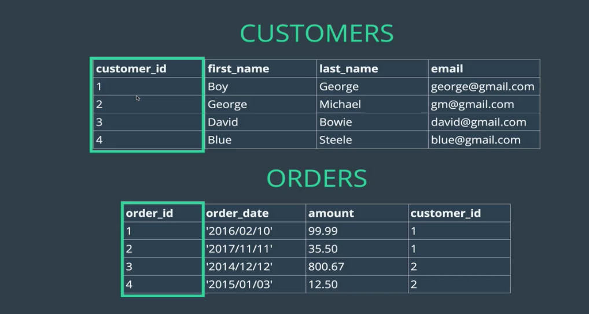

# One To Many

## (Intro) Relationship Basics:

There are three main types of data relationships:
- One to one
- One to many relationship
- Many to may relationship

One to one is slightly less common, but one likely example might whereby data on one user is too much to store on one table, so its split out in to several tables. Here you might have a user with a username on one table, and their billing address on another table.

One to many describes how one entity can be linked to several of another entity, such as one user leaving many reviews of books, or having any orders in their order history. Here, the user can be connected to any number reviews or orders, but each of these reviews or orders can only be connected to one user.

Many to many could be demonstrated when a blog post is `"liked"` by many users, and those user like several blog posts. Here, a user's `"likes"` can be linked to any number of blog posts, and those blog posts can be connected to any number of user `"likes"`, so the relationship is many to many.

### Primary Keys
A primary key is a field in a table which uniquely identifies each row / record in a database table. They must be unique, and cannot be `null`.

A table can have only one primary key, which may consist of single or multiple fields. When multiple fields are used as a primary key, they are called a composite key.

If a table has a primary key defined on any field(s), then you cannot have two records having the same value of that field(s).

