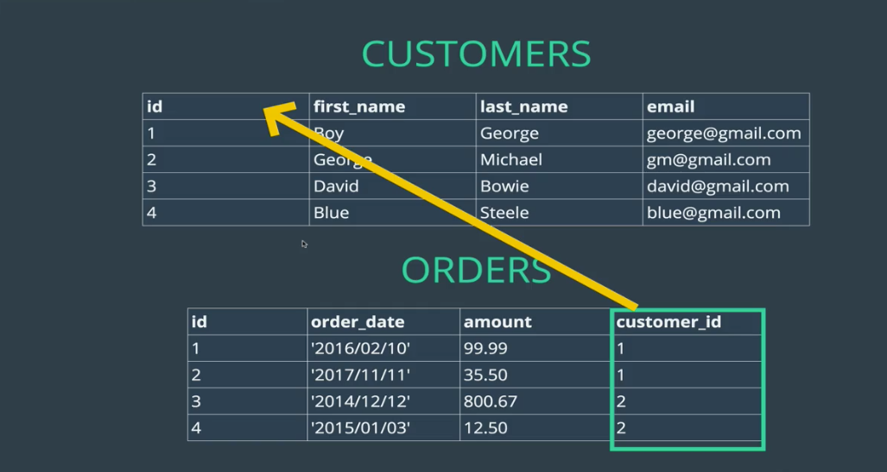

# One To Many

## (Intro) Relationship Basics:

There are three main types of data relationships:
- One to one
- One to many relationship
- Many to may relationship

One to one is slightly less common, but one likely example might whereby data on one user is too much to store on one table, so its split out in to several tables. Here you might have a user with a username on one table, and their billing address on another table.

One to many describes how one entity can be linked to several of another entity, such as one user leaving many reviews of books, or having any orders in their order history. Here, the user can be connected to any number reviews or orders, but each of these reviews or orders can only be connected to one user.

Many to many could be demonstrated when a blog post is `"liked"` by many users, and those user like several blog posts. Here, a user's `"likes"` can be linked to any number of blog posts, and those blog posts can be connected to any number of user `"likes"`, so the relationship is many to many.

### Primary Keys
A primary key is a field in a table which uniquely identifies each row / record in a database table. They must be unique, and cannot be `null`.

A table can have only one primary key, which may consist of single or multiple fields. When multiple fields are used as a primary key, they are called a composite key.

If a table has a primary key defined on any field(s), then you cannot have two records having the same value of that field(s).


In the above diagram, each table has a primary key, for customers: `customer_id`, for orders, `order_id`. Every entry of each of them is unique, and never null, and can therefore be used to reference the entire entry quickly and easily.

Refresher on how to [declare a `PRIMARY KEY`](https://github.com/edgarfinn/Learning-MySQL/blob/master/1_Creating_tables_and_inserting_data.md#primary-keys)

### Foreign keys
A foreign key is a key used to link two tables together. This is sometimes also called as a referencing key.

A Foreign Key is a column or a combination of columns whose values match a Primary Key in a different table.

The relationship between 2 tables matches the Primary Key in one of the tables with a Foreign Key in the second table.

If a table has a primary key defined on any field(s), then you cannot have two records having the same value of that field(s).



Syntax for adding a foreign key constraint:

```SQL
CREATE TABLE customers(
    id INT AUTO_INCREMENT PRIMARY KEY,
    first_name VARCHAR(100),
    last_name VARCHAR(100),
    email VARCHAR(100)
);

CREATE TABLE orders(
    id INT AUTO_INCREMENT PRIMARY KEY,
    order_date DATE,
    amount DECIMAL(8,2),
    customer_id INT,

    FOREIGN KEY(customer_id) REFERENCES customers(id)
);

-- For the sake of illustration, the below will be inserted into these tables:

-- INSERT INTO customers (first_name, last_name, email)
-- VALUES ('Boy', 'George', 'george@gmail.com'),
--        ('George', 'Michael', 'gm@gmail.com'),
--        ('David', 'Bowie', 'david@gmail.com'),
--        ('Blue', 'Steele', 'blue@gmail.com'),
--        ('Bette', 'Davis', 'bette@aol.com');
--
--
-- INSERT INTO orders (order_date, amount, customer_id)
-- VALUES ('2016/02/10', 99.99, 1),
--        ('2017/11/11', 35.50, 1),
--        ('2014/12/12', 800.67, 2),
--        ('2015/01/03', 12.50, 2),
--        ('1999/04/11', 450.25, 5);
```

One big benefit of the Foreign Key constraint is that it will return an error if you attempt to insert data that doesn't match the foreign table its meant to be referencing. For example above, it would not let you insert an order if the customer_id did not exist in the customers table.

### Sub-Queries

```SQL
SELECT * FROM orders WHERE customer_id =
    (
        SELECT id FROM customers
        WHERE last_name='George'
    );
```

The inner query is evaluated first, and its result is passed to the outer query in place of the code between the parentheses. So in this example, whereby Boy George is customer id 1, its the same as:

```SQL
SELECT * FROM orders WHERE customer_id =
    1;
```

### Joins

[W3 definition of joins](https://www.w3schools.com/sql/sql_join.asp):
> A JOIN clause is used to combine rows from two or more tables, based on a related column between them

A basic example of a join could be that you want to see a list of customers (names) with information the orders they've placed (order date and amount). The customers' names need to be pulled from the customers table, whilst the order information needs to be drawn from the orders table.

```SQL
SELECT first_name, last_name, order_date, amount
    FROM customers, orders
        WHERE customers.id = orders.customer_id;
-- +------------+-----------+------------+--------+
-- | first_name | last_name | order_date | amount |
-- +------------+-----------+------------+--------+
-- | Boy        | George    | 2016-02-10 |  99.99 |
-- | Boy        | George    | 2017-11-11 |  35.50 |
-- | George     | Michael   | 2014-12-12 | 800.67 |
-- | George     | Michael   | 2015-01-03 |  12.50 |
-- | Bette      | Davis     | 1999-04-11 | 450.25 |
-- +------------+-----------+------------+--------+
-- 5 rows in set (0.00 sec)
```

Notice that:
  - a) The SELECT criteria is calling on data from both the `customers` and `orders` tables.
  - b) You're selecting *from* multiple tables.
  - c) You're limiting the search to only fields where `orders.customer_id` matches `customers.id`

The above example is old syntax, and is an implicit join (the join is _implied_ by the cross-table WHERE constraint.)

A modern, more favoured, explicit way to query the exact same info would be to use the `JOIN` keyword:
```SQL
SELECT first_name, last_name, order_date, amount
    FROM customers
    JOIN orders
        ON customers.id = orders.customer_id;
-- +------------+-----------+------------+--------+
-- | first_name | last_name | order_date | amount |
-- +------------+-----------+------------+--------+
-- | Boy        | George    | 2016-02-10 |  99.99 |
-- | Boy        | George    | 2017-11-11 |  35.50 |
-- | George     | Michael   | 2014-12-12 | 800.67 |
-- | George     | Michael   | 2015-01-03 |  12.50 |
-- | Bette      | Davis     | 1999-04-11 | 450.25 |
-- +------------+-----------+------------+--------+
-- 5 rows in set (0.00 sec)
```

This is exactly the same as the previous query.

### Inner Joins vs Left Joins

The above examples are inner joins, because they are only taking parts of the data from each table, (generally the most common type of join).

Sometimes you might still want to select everything from one table, and only come from another, which is where Left and Right joins come in. One example might be where you wanted to list the total amount spent by every customer. Bearing in mind not all customers have placed orders, you might still want these people listed as having spent nothing (£0).

```sql
SELECT first_name, last_name, amount FROM customers LEFT JOIN orders ON customers.id = orders.customer_id;
-- +------------+-----------+--------+
-- | first_name | last_name | amount |
-- +------------+-----------+--------+
-- | Boy        | George    |  99.99 |
-- | Boy        | George    |  35.50 |
-- | George     | Michael   | 800.67 |
-- | George     | Michael   |  12.50 |
-- | David      | Bowie     |   NULL |
-- | Blue       | Steele    |   NULL |
-- | Bette      | Davis     | 450.25 |
-- +------------+-----------+--------+
-- 7 rows in set (0.00 sec)
```

This lists all customers' names from the customers table, plus order amounts form the orders table (where they've been joined to match orders' customer ids to the right customers), then to flatten this into totals per customer, you could use aggregate functions with group by like so:

```sql
SELECT
    first_name,
    last_name,
    IFNULL(SUM(amount), 0) AS total_spent
FROM customers
LEFT JOIN orders
    ON customers.id = orders.customer_id
GROUP BY customers.id;
-- +------------+-----------+-------------+
-- | first_name | last_name | total_spent |
-- +------------+-----------+-------------+
-- | Boy        | George    |      135.49 |
-- | George     | Michael   |      813.17 |
-- | David      | Bowie     |        0.00 |
-- | Blue       | Steele    |        0.00 |
-- | Bette      | Davis     |      450.25 |
-- +------------+-----------+-------------+
-- 5 rows in set (0.00 sec)
```

(Note: [Read about `IFNULL` here](https://www.w3schools.com/sql/func_mysql_ifnull.asp))
