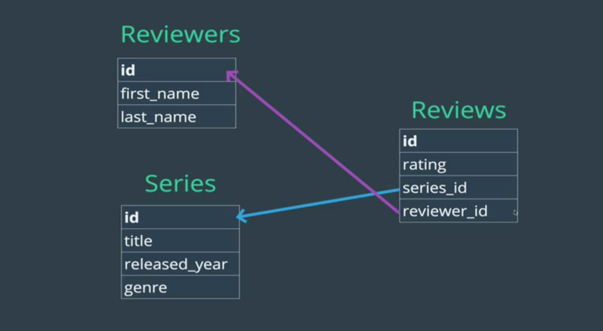

# Many To Many

Some examples where you might see Many To Many relationships:

- Books and authors
    - (books can have several authors, and authors can write several books)
- Students and classes
    - (students go to lots of different classes, and classes usually have multiple students)
- Events and attendees
    - (people on meetup.com might attend several events, and events have many people attending)
- TV Series and Reviewers

Many to many relationships between two entities generally occur when a third table joins them. For example with TV Series and Reviewers, its most likely you'd have a third table for the Reviews, which would link the reviewers to the series' they've reviewed.

